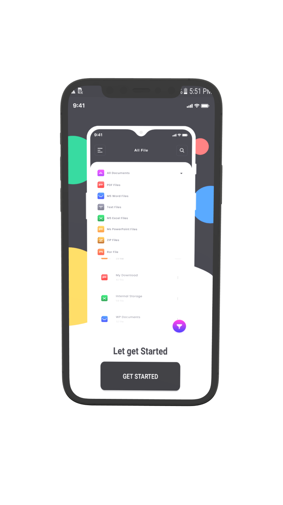
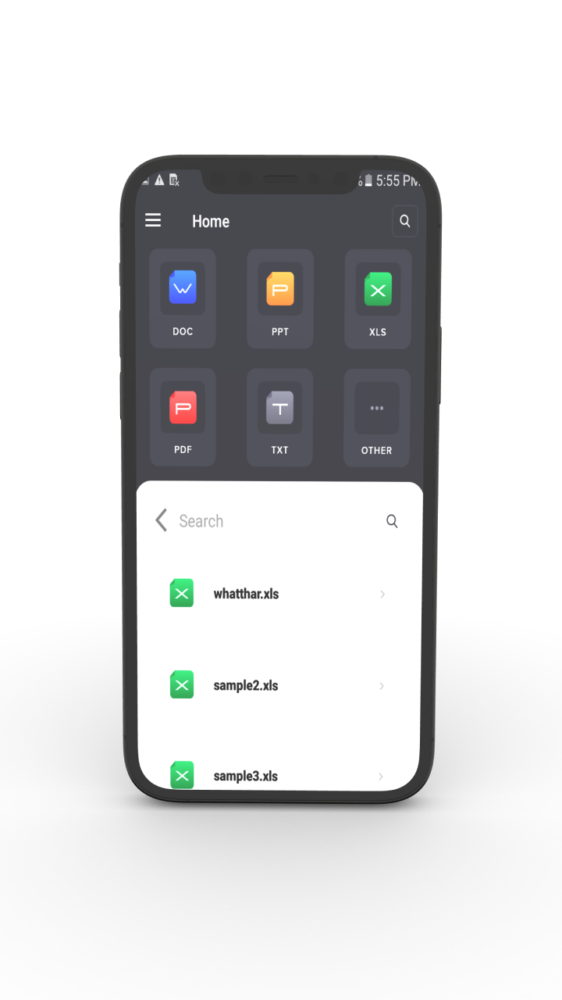
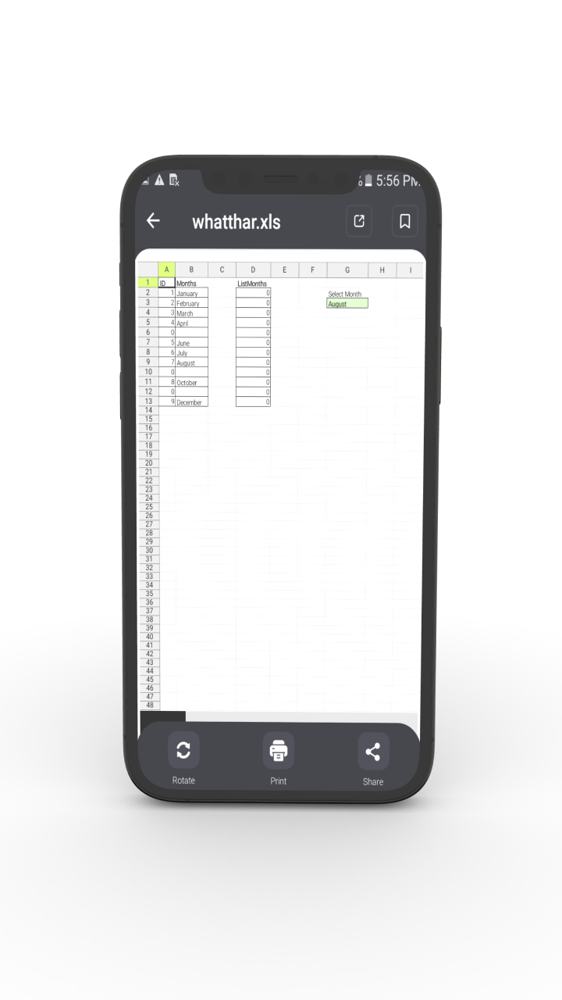
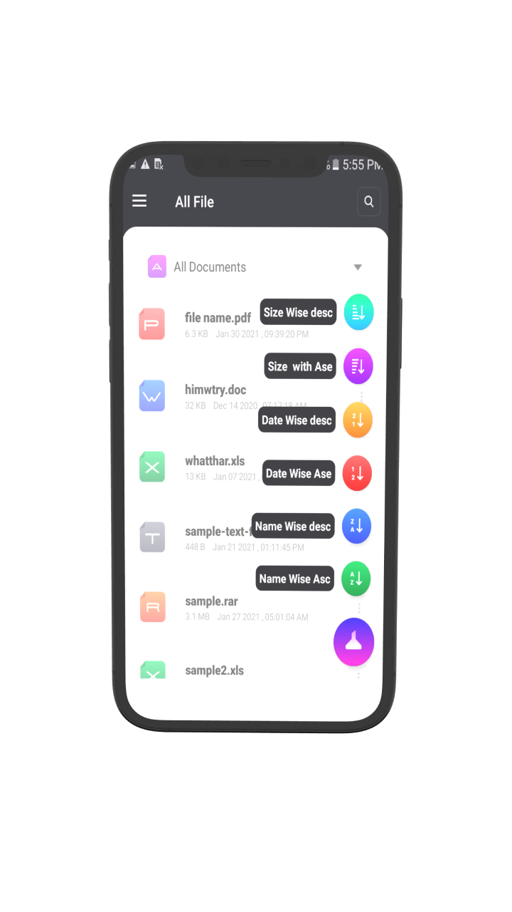
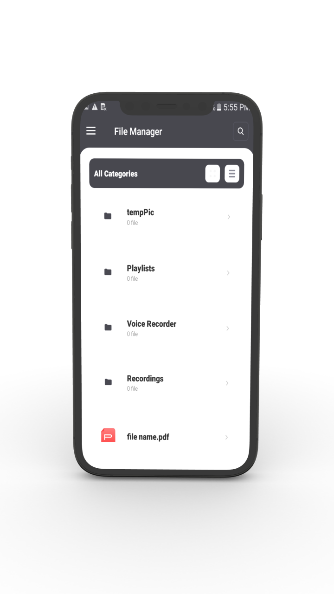

# Document Manager

An app that brings all document in your phone in one place .

## Libraries

*   [Glide](https://github.com/bumptech/glide) : Glide is a fast and efficient open source media management and image loading framework for Android
*   [PhotoView](https://github.com/Baseflow/PhotoView) : PhotoView aims to help produce an easily usable implementation of a zooming Android ImageView.

<h2 align="left">Screenshots</h2>
<h4 align="center">

 
 

